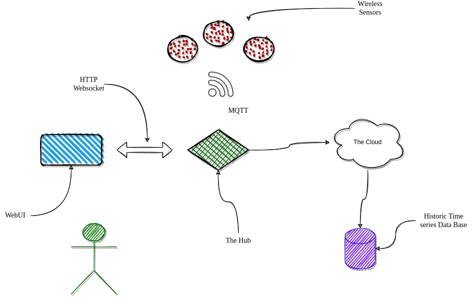

## How Does Sensor Station Work?

Sensor Station is a System rather than single application: we have a
set of battery powered, wireless sensors that transmit environmental
data (temprature, humidity, moisture and light) to a hub that serves
up this data on a real-time dashboard. Optionally, if and when an
Internet connection is available, the hub will stash it's local data
(_timeseries_ database) in _the cloud_.

## The Software 

### Sensors - Wireless and Battery Powered

Taking advantage of the esp32 Mesh Network, sophisticated power modes
and over-the-air updates 

### Hub - Aggregate and care for sensors mesh network

The Hub aggregates and cares for it's self organizing mesh network of
sensors. It is the conduit between the dashboard and the cloud! 

### Dashboard - Real-Time and Historic

The dashboard is a WebUI built into the Hub providing a window  into
your environments health.

### Cloud - Globalizing your Environment

Time series data is pushed to the cloud for global access, as well as
global control! 

## Open Source / Open Tech 

- Go backend ~ small, FAST and easy to deploy
- VueJS Dashboard ~ styled with Paper it does not get any sexier
- REST API ~ it was designed to be part of an automation
- Web Sockets ~ makes the real-time dashboard not only possible, but
  exciting! 
- Ansible Deployment ~ It does not get any easy to deploy a complex
  environment with a nice clean ansible fired CI/CD pipeline
- Cloud Native ~ Our application(s) were designed to run as well in
  the cloud, a container or a baremetal host all the same!
  
